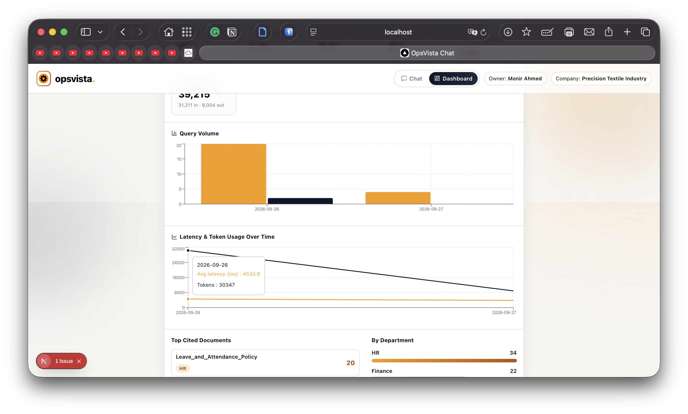
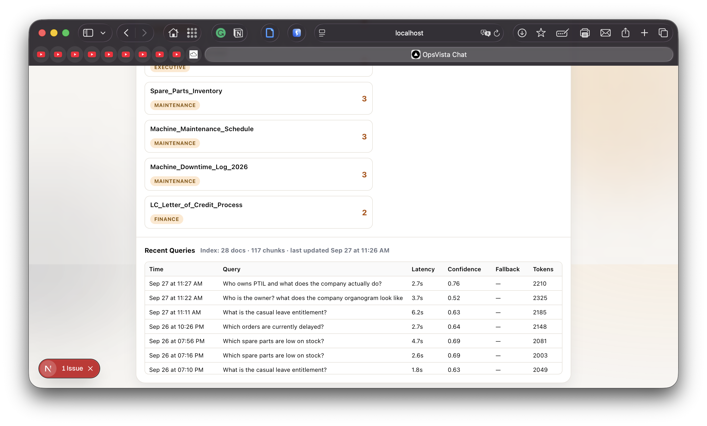

# 🧠 OpsVista — RAG Knowledge Assistant

<div align="center">


**Ask questions about your company's own documents in plain English. Get grounded, cited answers.**

Internal knowledge assistant for **Precision Textile Industry LTD (PTIL)**, built end-to-end: dual-path retrieval, real-time streaming, observability dashboard, scheduled reindexing, and role-based access control.

<br/>


<br/>

</div>

---

## 🛠️ Technology Stack

### Languages & Core


### Frontend Framework & Styling


### Backend & AI


-412991?style=for-the-badge&logo=openai&logoColor=white)

### Data, Auth & Vector Store


### Dev Tools, Testing & CI/CD


### Hosting


<br/>

| Category | What's actually used |
|---|---|
| 🐍 **Backend runtime** | Python 3.13, FastAPI, Uvicorn, Pydantic v2, `slowapi` (rate limiting) |
| ⚛️ **Frontend** | Next.js 15 (App Router), React 19, TypeScript, Tailwind CSS v4, `lucide-react`, `recharts`, `react-markdown` |
| 🗄️ **Database, Auth & Vector Store** | Supabase — managed Postgres, Auth (JWT), Row Level Security, `pgvector` extension |
| 🤖 **LLM & Embeddings** | Google Gemini (`gemini-flash-lite-latest` generation, `gemini-embedding-001` embeddings) — primary; OpenAI supported as an alternate provider |
| 📄 **Document ingestion** | Google Drive API v3, `pypdf`, `python-docx`, `pandas` + `openpyxl` |
| 🧪 **Testing** | `pytest` (backend, 27 tests) + `mocha` (frontend, 18 tests) — see [Testing](#-testing) |
| ⚙️ **CI/CD** | GitHub Actions — lint/test/build on every push, nightly scheduled reindex |
| 🛠️ **Dev tooling** | `scripts/check-env.js` — plain Node.js, verifies required env vars before you run anything |
| ☁️ **Hosting** | Render (backend), Vercel (frontend) |

---

## 📋 Table of Contents

- [🎯 Overview](#-overview)
- [✨ Features](#-features)
- [▶️ Run Locally](#️-run-locally)
- [🏗️ Architecture](#️-architecture)
- [🚀 Getting Started (fresh setup)](#-getting-started-fresh-setup)
- [📁 Project Structure](#-project-structure)
- [📡 API Reference](#-api-reference)
- [🔄 Scheduled Reindexing](#-scheduled-reindexing)
- [📊 Observability](#-observability)
- [🔐 Security](#-security)
- [🧪 Testing](#-testing)
- [🌐 Deployment](#-deployment)
- [🖼️ Screenshots](#️-screenshots)
- [🩺 Troubleshooting](#-troubleshooting)
- [📄 License](#-license)

---

## 🎯 Overview

**OpsVista** replaces "dig through Google Drive folders yourself" with a chat assistant that actually knows the company's documents — finance records, HR policy, commercial orders, maintenance logs, admin procedures — and answers in plain English with **citations back to the real source file**.

**How it works, simply:** documents in Google Drive get chunked and embedded → a question gets embedded the same way and matched against the closest chunks → an LLM (Gemini) writes an answer using only that retrieved context → the original chunks come back as citations. If the primary search comes back empty or low-confidence, a second independent Postgres/pgvector search gets a try — the **dual-path** design covered in detail in [Architecture](#️-architecture).

### What this actually does, beyond a typical demo

- 🔀 **Dual-path retrieval** — primary vector index + a Postgres/pgvector fallback gated on confidence and source diversity, not just "zero results"
- ⚡ **Token-by-token streaming** — Server-Sent Events, not a spinner-then-dump
- 🔍 **Grounding transparency** — every answer shows which retrieval path answered, its confidence, and source diversity
- 👍 **Feedback loop** — thumbs up/down persisted to the audit trail
- 🌙 **Everyday freshness** — a nightly cron re-scans Google Drive automatically; an Owner/Admin can also trigger it on demand (cadence details in [Scheduled Reindexing](#-scheduled-reindexing))
- 📈 **Observability dashboard** — every query logged (latency, confidence, tokens, fallback rate)
- 🔒 **Role-based access** — Supabase Auth + role-gated admin endpoints

### The knowledge base needed a "who/what/how" document, not just department records

Six department folders full of ledgers, policies, and logs answer *operational* questions fine, but none of them said who owns the company, what it manufactures, or how departments relate to each other. [`Monir Ahmed (Executive)/PTIL_Company_Overview.md`](<backend/seed_docs/Monir Ahmed (Executive)/PTIL_Company_Overview.md>) fixes that: ownership, business lines, org structure, and department heads, in one reference document — chunked, embedded, and indexed exactly like everything else, no special-cased prompt.

> **Caveat:** this file is seeded into the local index and Supabase, but not yet uploaded to a real Drive folder. A full Drive reindex rebuilds strictly from what's in Drive, so until the same file exists in a real `Monir Ahmed (Executive)` folder (shared with the service account), a full reindex will drop it. Details in [Google Drive Setup](#google-drive-setup).

---

## ✨ Features

Everything below is visible in the running app today. Each item links back to where it's implemented so you can verify it against the code, not just this description.

### 💬 Chat — what each part of the widget shows

| Element | What it shows | Why |
|---|---|---|
| 🗂️ Department badge | e.g. `HR · 4` — right under the answer | Know at a glance which department's documents fed the answer, without expanding anything |
| 📎 "N sources" button | A real clickable toggle, not a disguised link | Expands the full citation list on demand: file name, department, Drive link, relevance score |
| 🧭 Trace panel | Which index answered (primary vs. pgvector fallback), confidence %, source diversity % | Shows *how* the answer was found, not just what it cited |
| 🔁 "Similar questions" | Prior questions whose embedding clears an 80% cosine-similarity match against this one | Real signal from `fact_query_embedding` + a `match_queries()` pgvector RPC — same dual-path pattern as document retrieval, applied to query history. Empty means genuinely no similar question yet, not a broken feature |
| 👍👎 Feedback | Thumbs up/down on the answer | Persisted to `fact_query.user_rating` |
| 🕐 "Synced X ago" badge | Age of the underlying index | Know if the knowledge base might be stale before trusting an answer |
| 📊 Excel citation charts | Spreadsheet-derived sources render as a table *and* a bar chart | A magnitude filter drops columns on a wildly different scale (e.g. unit price vs. total value) so one series doesn't get visually crushed |

<br/>

<br/>

### 🔐 Auth & Access

- Email/password signup with name + email confirmation flow
- Session-gated chat access for any employee
- **Owner/Admin-only** observability dashboard and reindex controls
- Sign-out on both the chat page and the dashboard

### 📊 Observability Dashboard

- Query volume, avg/p95 latency, fallback rate, avg confidence, token usage
- Top cited documents & departments, ranked
- Recent query log with latency/confidence/fallback/tokens per row
- "Reindex now" button with live progress polling

<br/>

<br/>

Want to see this running before reading further? Jump to [Run Locally](#️-run-locally). Want the full technical picture — how a request actually flows through retrieval, generation, and storage — that's [Architecture](#️-architecture) next.

---

## ▶️ Run Locally

If you're working from an existing checkout of this repo (env vars, index, and Supabase already configured — not a fresh clone), this is all you need:

```bash
# Terminal 1 — backend
cd backend && source ../.venv/bin/activate && uvicorn app.main:app --reload --port 8000

# Terminal 2 — frontend
cd frontend && npm run dev
```

Then open **http://localhost:3000**. Sign in with your own account, or **"Create one"** on the login screen if you don't have one yet — new signups have no admin role by default, so the dashboard/reindex button will 403 until an Owner grants one (see [Security](#-security) for the exact command).

Not sure your `.env` / `frontend/.env.local` are actually filled in? Run the sanity check first:

```bash
node scripts/check-env.js
```

Setting this up from scratch (new clone, new Supabase project) is a longer process — see [Getting Started](#-getting-started-fresh-setup) below.

---

## 🏗️ Architecture

If you're new to this project, this section is written to stand on its own: read top to bottom and you should come away knowing what each layer does, how a question actually turns into an answer, and where the data lives — without needing to read the code first.

At a glance, OpsVista has four layers. A **Next.js client** (chat, login, dashboard) talks to a **FastAPI backend** over a Supabase-authenticated session. The backend's core job is retrieval: given a question, it searches a **primary in-memory vector index** first, and only falls back to a **Postgres/pgvector index in Supabase** when the primary result is weak or empty — this is the "dual-path" design referenced throughout this document. Whichever path answers, the matched text gets handed to **Gemini** (or OpenAI, if configured instead) to generate the actual reply, grounded strictly in that retrieved context. Two things happen in parallel with every request: the interaction gets logged to Supabase for the observability dashboard, and — separately — Google Drive is where the source documents themselves live, scanned on a schedule (or on demand) to keep the index current.

The diagram below is the literal implementation of that description:

```
┌──────────────────────────────────────────────────────────────────────┐
│                          CLIENT (Next.js)                            │
│   Chat UI (streaming)      Login/Signup       Observability Dash     │
└──────────────────────────────┬───────────────────────────────────────┘
                               │  Supabase JWT
┌──────────────────────────────▼────────────────────────────────────────┐
│                        API LAYER (FastAPI)                            │
│  /chat/complete   /chat/stream   /chat/feedback   /admin/reindex      │
│  ┌─────────────────────────────────────────────────────────────┐      │
│  │      retrieve_with_trace() — dual-path quality gate         │      │
│  │  ┌───────────────────────┐      ┌─────────────────────┐     │      │
│  │  │  Enhanced Index (JSON)│ ───▶ │ pgvector fallback   │     │      │
│  │  │  primary, in-memory   │◀───. │ (confidence < 0.5)  │     │      │
│  │  └───────────────────────┘      └─────────────────────┘     │      │
│  └─────────────────────────────────────────────────────────────┘      │
│                                │                                      │
│                     ┌──────────▼──────────┐                           │
│                     │  Gemini / OpenAI LLM│                           │
│                     └─────────────────────┘                           │
└───────────────────────────────┬─────────────────────────────────────┬─┘
                                │                                     │
                 ┌──────────────▼───────────────┐         ┌────────────▼────────────┐
                 │   Supabase (Postgres)        │         │   Google Drive API v3   │
                 │   dim_document / fact_chunk  │         │   department folders    │
                 │   fact_embedding / fact_query│         └─────────────────────────┘
                 │   bridge_query_citation      │
                 └──────────────────────────────┘
```

<p align="center">
  
</p>

**What this shows:** the four layers described above — client, API, dual-path retrieval, and the two external stores (Supabase, Google Drive).

> **In plain English — what this picture is actually saying**
> - Top right, **"Frontend Layer"**: this is the webpage a person actually looks at and clicks (`frontend/src/app/page.tsx`). The moment it loads, it fires off a handful of small background requests — "am I online," "is the AI provider working," "when was the search index last refreshed" — and separately, whenever someone hits Send, one big request to ask a question.
> - Middle, **"FastAPI Application"**: this is the Python web server itself. `main.py` is the front door; a few small routes handle simple status checks; and the box labelled **"Chat Router"** (`chat.py`) is where every real question actually gets processed — everything below it is what happens *inside* answering one question.
> - Below the Chat Router, two side-by-side boxes it hands work off to:
>   - **"Retrieval Layer"** (green, right) — the part whose job is "go find the right document snippets." `retrieve_with_trace()` is the traffic cop: it tries the fast, built-in search first (a plain JSON file, already loaded in the server's memory, searched by comparing *meaning*, not just keywords). Only if that comes back weak or empty does it try the second, slower search shown as the "fallback" branch.
>   - **"Generation Layer"** (purple, left) — once documents are found, `_build_prompt()` glues the user's question and those documents into one big block of instructions, and hands it to `LLMClient` (a wrapper class that knows how to talk to an AI model) to actually write the answer.
> - Bottom, **"External Services"**: the real outside systems this server talks to over the network — an AI provider (for writing answers), **Supabase** (a hosted database storing both user logins and the document search data), and **Google Drive** (where the original company files — PDFs, Word docs, spreadsheets — actually live before anything is indexed).
> - **"Index Artifacts" → `enhanced_index.json`**: one single file, sitting on the server's own hard disk, holding every document chunk and its numeric "fingerprint" (embedding) — the file the fast built-in search actually reads.
> - Bottom right, **"Supabase Auth Client"**: the one piece of code that runs in the browser itself (not on the server) and talks to Supabase directly, just to handle logging a user in and getting them an access token.
>
> ⚠️ **Naming note:** the diagram shows the fallback search going through a file called `search_integration.py`. In the current codebase that role is played by a newer, differently-named file, `pgvector_store.py` — same job, just rewritten since this diagram was drawn (see the note under "Retrieval decision flow" below for the full story).

### Retrieval decision flow

Zooming into the single most important decision the backend makes on every request: which of the two retrieval paths gets to answer.

<p align="center">
  
</p>

The primary index searches first; pgvector only gets a turn if the primary path comes back empty **or** its confidence is too low — this second condition is the real quality gate (`retrieve_with_trace()` in `chat.py`), not just an empty-results check. Source diversity is scored alongside confidence. Every response's `trace` object shows exactly what happened:

```json
{
  "impl": "enhanced_index",
  "retrieval_confidence": 0.83,
  "source_diversity": 0.75,
  "used_fallback": false
}
```

> **In plain English — following the arrows top to bottom**
> 1. **"User Query (message)"** — the plain-English question the person typed arrives at the backend.
> 2. **`retrieve_with_trace()`** — one function in `chat.py` that owns the entire decision made in this diagram.
> 3. The green diamond, **"Enhanced Index Has Hits?"** — the fork in the road: did the fast, built-in search find anything good?
>    - **Yes** → `EN.search(query, top_k)` — "EN" is short for "Enhanced index." It turns the question into a list of numbers (an embedding) and compares it against every stored chunk's own numbers using **cosine similarity** (the closer two pieces of text mean the same thing, the higher this score). `top_k` just means "give me back this many of the best matches" (4, by default).
>    - **No** → the diagram's `_integrated_retrieve()` / `IntegratedSearchManager` boxes. ⚠️ **This exact pairing of names is from an earlier version of the code** — today this branch is `_pgvector_retrieve()` calling `pgvector_search()` in `pgvector_store.py`, which runs the equivalent search against a copy of the same data stored in Supabase's Postgres database instead of in memory. (`pgvector_store.py`'s own header comment says outright that it "replaces the previously-dormant `integrated_search_system.py` / `search_integration.py` scaffolding, which never actually implemented a vector backend.")
> 4. Both branches meet at **`_norm_one()` Normalize** — no matter which of the two searches actually answered, this step reshapes the result into one consistent format (`{text, score, metadata}`), so nothing downstream has to know or care which search engine found it.
> 5. **`_build_prompt(message, docs)`** — takes the original question plus the found document snippets and assembles the actual block of text (with instructions on tone, length, and formatting) sent to the AI.
> 6. **`LLMClient.complete()`** — the real network call out to the AI model that reads that prompt and writes an answer.
> 7. **`ChatResponse {content, sources, trace}`** — the finished package sent back to the browser: the written answer, which documents it was based on (these become the citation cards under the answer), and a `trace` object recording exactly what happened — this is literally what the chat UI's collapsible "Trace Panel" displays.

### Chat request sequence

The full round trip for a single question — from the moment the client sends it to the moment the answer, its citations, and its audit-log row are all in place.

<p align="center">
  
</p>

> **In plain English — this is a "sequence diagram."** Each vertical line is one participant in the story; time moves top to bottom; every arrow is one message passed between them. The six participants (left to right): the **Client** (the person's web browser), **FastAPI (/chat/stream)** (the backend's streaming chat endpoint, in `chat.py`), the **Enhanced Index** (the fast, built-in, in-memory search), **pgvector** (the backup search, living inside the Supabase Postgres database), **Gemini** (the AI model that actually writes the answer), and **Supabase audit tables** (a separate set of database tables that just keep a permanent log of every question ever asked, for the dashboard).
>
> 1. **Client → FastAPI:** `POST /api/rag/chat/stream {message, top_k}` — the browser sends the typed question to the backend, plus `top_k` (how many source documents to retrieve — 4 by default).
> 2. **FastAPI → Enhanced Index:** `search(query, top_k)` — the backend immediately asks its fast, in-memory search for the best-matching chunks of text.
> 3. **Enhanced Index → FastAPI:** `docs + confidence` — it returns whatever chunks it found, plus a confidence number: how sure it is the very best match is actually relevant.
> 4. **The "alt" box** — "alt" is diagram shorthand for "alternative": exactly one of the two paths below happens, never both, decided by the confidence number from step 3:
>    - **[confidence ≥ 0.5]** — *"use primary docs as-is."* The search was confident enough, so the backend just goes with what it already has. Skip straight to step 7.
>    - **[confidence < 0.5, or zero results]** — the backend doesn't trust this answer (or found nothing at all), so it tries a second, independent search:
>      - **FastAPI → pgvector:** `match_chunks(embedding, top_k)` — calls a function that lives directly inside the Postgres database (not Python code) which runs the same kind of similarity search against a second, independently-stored copy of the document data.
>      - **pgvector → FastAPI:** `fallback docs` — the backup search's results come back and *replace* the original weak ones entirely — the two are never merged.
> 5. **FastAPI → Supabase (audit tables):** `find_similar_queries(message) [best-effort]` — completely separately, the backend also asks the database "has anyone asked something similar to this before?" **"Best-effort"** means: if this call fails for any reason, the rest of the request keeps going regardless — it's a nice-to-have, not something that can ever break the answer.
> 6. **Supabase → FastAPI:** `similar_queries[] (only if similarity ≥ 0.80, else [])` — the database hands back a short list of genuinely similar past questions (at least 80% similar by meaning), or nothing if none came close.
> 7. **FastAPI → Client:** `SSE meta {chat_id, sources, trace, warnings, similar_queries}` — before the AI has written a single word, the backend already sends the browser its first message: a unique ID for this exchange, which documents it's about to answer from, the trace info, any warnings, and those similar past questions. **SSE** ("Server-Sent Events") is just a way for the server to keep pushing small messages to the browser one at a time over a single open connection, instead of the browser having to ask over and over.
> 8. **FastAPI → Gemini:** `stream_with_messages(prompt + context)` — only now does the backend hand the assembled prompt (question + retrieved document text) to the actual AI model and ask it to start writing.
> 9. **The "loop" box, "each streamed chunk"** — the AI doesn't send its whole answer at once, it sends it piece by piece. A **"delta"** is simply "the next small new piece of text."
>    - **Gemini → FastAPI:** `text delta` — one small piece of the answer arrives.
>    - **FastAPI → Client:** `SSE token {content}` — the backend immediately forwards that exact piece to the browser. This is the entire mechanism behind the answer appearing to "type itself out" live — nothing is buffered and dumped all at once.
> 10. **The "opt" box, "generation fails"** — "opt" means "optional, only if this happens": **FastAPI → Client:** `SSE error {message}` — if something breaks while the AI is writing, the backend sends one more message explaining what went wrong, so the browser can show a clear error instead of just freezing.
> 11. **FastAPI → Client:** `SSE done {model, usage, processing_time_ms}` — once the AI has finished, the backend sends a final wrap-up: which AI model actually answered, roughly how much text was processed (`usage`, measured in "tokens" — word-pieces, not whole words), and how long the entire request took.
> 12. **FastAPI → Supabase (audit tables):** `log_query() → fact_query + bridge_query_citation` — *after* the browser already has its complete answer, the backend quietly writes a permanent record: one row remembering the question, its timing, and which search path was used, plus one extra row per document cited, so the dashboard can later show "most-cited documents."
> 13. **FastAPI → Supabase (audit tables):** `upsert_query_embedding(chat_id, message) → fact_query_embedding` — finally, the backend saves a numeric fingerprint of the question itself, so the *next* time someone asks something similar, steps 5–6 above will be able to find and surface this one.

### Data model

What actually gets stored, and how it connects — one row per source document, chunked into embeddings, with every question and its citations logged for the dashboard.

<p align="center">
  
</p>

> **In plain English — this is an "ER diagram"** (Entity-Relationship diagram): a standard way to draw a database's tables and how their rows point at each other, with no code shown at all.
> - **DIM_DOCUMENT** (top) — one row per source file: a specific PDF, Word document, or spreadsheet. `document_id` is its unique ID (marked **PK**, "Primary Key" — every row gets a different one, guaranteed).
> - The line labelled **"contains"**, with the little forked "crow's foot" symbol at the FACT_CHUNK end, is ER-diagram shorthand for *"one document contains many chunks."*
> - **FACT_CHUNK** — one row per small piece ("chunk") of a document, roughly 900 characters each, because search works far better on focused paragraphs than on one giant wall of text. `document_id` here is marked **FK**, "Foreign Key" — meaning "this column's value points back to a row in another table" (here, back to the document this chunk came from).
> - **FACT_EMBEDDING** — one row per chunk's numeric "fingerprint." `embedding` is the actual list of 1536 numbers used for the similarity search described above.
> - **FACT_QUERY** (top right) — one row per question ever asked in the chat, ever. Holds the question text, whether the backup search had to kick in, how confident retrieval was, and the person's thumbs up/down rating if given.
> - **FACT_QUERY_EMBEDDING** — the same kind of numeric fingerprint, but of the *question* itself rather than a document — purely what powers "similar questions asked before."
> - **BRIDGE_QUERY_CITATION** (bottom middle) — a **"bridge table"**: a table whose only job is connecting two other tables together, since one question can cite many chunks and one chunk can be cited by many questions over time. Each row means "this specific question used this specific chunk as a source," with a relevance score and a rank — exactly what lets the dashboard answer "which documents get cited most often."

**[`backend/sql/schema.sql`](backend/sql/schema.sql) is the authoritative, executable source** — the table below summarizes it in one place:

| Table | Purpose |
|---|---|
| `dim_document` | One row per source file, department, classification |
| `fact_chunk` | Text chunks, ordinal position, full metadata (JSONB) |
| `fact_embedding` | The actual `vector(1536)` embeddings |
| `fact_query` | Audit log: every question, confidence, latency, tokens, fallback flag, user rating |
| `fact_query_embedding` | Each question's own `vector(1536)` — powers "similar questions" |
| `bridge_query_citation` | Which chunks were cited for which query, ranked |

**Why 1536 dims, not Gemini's native 3072?** `pgvector`'s `ivfflat`/`hnsw` indexes cap at 2000 dimensions; Gemini supports requesting a smaller output directly via `output_dimensionality=1536`.

**Why no ANN index on `fact_embedding` yet?** `ivfflat` needs ~`rows/1000` clusters to behave well — at a few hundred rows that's ~0–1 clusters, which made retrieval *worse* in testing. Exact search is both more accurate and fast enough below ~1,000–10,000 rows.

---

## 🚀 Getting Started (fresh setup)

Setting this up from a brand new clone. If you already have a working checkout, see [Run Locally](#️-run-locally) instead.

### Prerequisites

- Python ≥ 3.11
- Node.js ≥ 18
- A Supabase project (free tier works) with the `vector` extension enabled
- A Gemini API key ([aistudio.google.com/apikey](https://aistudio.google.com/apikey), free tier available) — or an OpenAI key as an alternative
- *(Optional, for real Drive ingestion)* a Google Cloud service account with Drive API access

### 1. Clone and install

```bash
git clone https://github.com/mahirvisoredbroom855/opsvista-software.git
cd opsvista-software

python3 -m venv .venv && source .venv/bin/activate
pip install -r requirements.txt

cd frontend && npm install && cd ..
```

### 2. Configure environment

Copy `.env.example` → `.env` at the repo root and fill in:

```bash
SUPABASE_URL=https://<project>.supabase.co
SUPABASE_ANON_KEY=...
SUPABASE_SERVICE_ROLE_KEY=...        # bypasses RLS — used by ingestion & audit logging

GEMINI_API_KEY=...
GEMINI_MODEL=gemini-flash-lite-latest
GEMINI_EMBEDDING_MODEL=gemini-embedding-001
GEMINI_EMBEDDING_DIM=1536             # must stay ≤2000 for pgvector indexing

USE_MOCK_EMBEDDINGS=false             # true = deterministic hash vectors, zero cost/API calls
GOOGLE_DRIVE_CREDENTIALS_PATH=backend/credentials/google_credentials.json
CORS_ALLOWED_ORIGINS=http://localhost:3000

REINDEX_AUTOMATION_TOKEN=...          # optional — enables the nightly cron trigger
```

Run `backend/sql/schema.sql` once in your Supabase SQL Editor — on a **fresh** project only, since it starts with `DROP TABLE`. On an existing project with real data, run this non-destructive migration instead (adds the `fact_query_embedding` table + `match_queries()` function behind "similar questions" without touching anything else):

```sql
CREATE TABLE IF NOT EXISTS fact_query_embedding (
    query_id      UUID PRIMARY KEY REFERENCES fact_query(query_id) ON DELETE CASCADE,
    embedding     VECTOR(1536) NOT NULL,
    generated_at  TIMESTAMPTZ DEFAULT now()
);
ALTER TABLE fact_query_embedding ENABLE ROW LEVEL SECURITY;

CREATE OR REPLACE FUNCTION match_queries(
    query_embedding TEXT,
    match_count INT DEFAULT 5,
    exclude_query_id UUID DEFAULT NULL
)
RETURNS TABLE (query_id UUID, query_text TEXT, similarity FLOAT, created_at TIMESTAMPTZ)
LANGUAGE sql STABLE
AS $$
    SELECT fq.query_id, fq.query_text,
           1 - (fqe.embedding <=> query_embedding::vector) AS similarity,
           fq.created_at
    FROM fact_query_embedding fqe
    JOIN fact_query fq ON fq.query_id = fqe.query_id
    WHERE exclude_query_id IS NULL OR fqe.query_id != exclude_query_id
    ORDER BY fqe.embedding <=> query_embedding::vector
    LIMIT match_count;
$$;
```

Copy/create `frontend/.env.local`:

```bash
NEXT_PUBLIC_API_BASE_URL=http://localhost:8000
NEXT_PUBLIC_SUPABASE_URL=https://<project>.supabase.co
NEXT_PUBLIC_SUPABASE_ANON_KEY=...
NEXT_PUBLIC_REQUIRE_AUTH=true
```

Sanity-check both files:

```bash
node scripts/check-env.js
```

### 3. Build the index

No Google Drive access yet? Use the local seed documents:

```bash
cd backend
python build_local_index.py --reset
```

Have a real Drive service account set up? See [Google Drive Setup](#google-drive-setup), then:

```bash
python build_drive_index.py --reset
```

Either script dual-writes into Supabase automatically.

### 4. Run it

```bash
cd backend && uvicorn app.main:app --reload --port 8000     # terminal 1
cd frontend && npm run dev                                   # terminal 2
```

Visit `http://localhost:3000`, sign up, and start asking questions.

### Google Drive Setup

1. **Google Cloud Console** → new project → enable the **Google Drive API**.
2. **APIs & Services → Credentials** → Create Credentials → **Service Account** → create a key (JSON) → save as `backend/credentials/google_credentials.json` (already gitignored).
3. Create one parent Drive folder containing your department subfolders, and **share only that parent folder** with the service account's email — permissions cascade automatically. Subfolder names must match (as a substring) an entry in `FOLDER_DEPARTMENT_MAP` (`backend/app/features/rag_chatbot/ingestion_common.py`): `Riaz Uddin Sarker` → Admin, `Md. Mizanur Rahman (PTIL)` → Finance, `Khorshed Alam Babu` → Maintenance, `Md. Mozammel Haque` → HR, `Zahedul Islam Nizam` → Accounting, `Md. Alamin` → Commercial, `Monir Ahmed` → Executive.
4. Upload documents. Supported: Google Docs, `.pdf`, `.docx`, `.xlsx`, `.txt`, `.md`. Include a `Monir Ahmed (Executive)` folder with [`PTIL_Company_Overview.md`](<backend/seed_docs/Monir Ahmed (Executive)/PTIL_Company_Overview.md>) — otherwise a full reindex has no company-identity document to fall back on.
5. Run `python build_drive_index.py --reset` (or trigger `POST /api/rag/admin/reindex` from an Owner/Admin session).

---

## 📁 Project Structure

```
opsvista-software/
├── backend/
│   ├── app/
│   │   ├── main.py                          # FastAPI entrypoint, startup hydration, rate limiter wiring
│   │   ├── core/
│   │   │   ├── config.py                    # Pydantic Settings (dev-safe defaults)
│   │   │   ├── auth_deps.py                 # get_current_user / require_roles / automation-token RBAC
│   │   │   ├── supabase_jwt.py              # Token verification via Supabase Auth API
│   │   │   └── rate_limit.py                # Shared slowapi Limiter instance
│   │   └── features/rag_chatbot/
│   │       ├── api/
│   │       │   ├── chat.py                  # /api/rag/chat/* — retrieval, streaming, feedback
│   │       │   ├── admin_metrics.py         # /api/rag/admin/metrics
│   │       │   └── discovery.py             # /api/rag/admin/reindex(/status)
│   │       ├── llm/
│   │       │   ├── llm_client.py            # Provider-agnostic (Gemini/OpenAI) LLM wrapper, streaming
│   │       │   └── prompt_engineering.py    # System prompt + adaptive length policy
│   │       ├── vector/
│   │       │   ├── persisted_inmemory_search.py  # Primary JSON index + shared embed_texts()
│   │       │   ├── pgvector_store.py             # Fallback search, dual-write, audit log, feedback, hydration
│   │       │   └── google_drive_service.py       # Drive API client (service account)
│   │       └── ingestion_common.py          # Shared chunking/extraction (PDF/DOCX/XLSX/TXT/MD)
│   ├── build_local_index.py                 # Build index from a local folder (no Drive/API key needed)
│   ├── build_drive_index.py                 # Build index from real Google Drive
│   ├── sql/schema.sql                        # Full Supabase schema, RLS, match_chunks() + match_queries() RPCs
│   ├── tests/                                # 27 pytest tests, mock embeddings, no network calls
│   └── seed_docs/                            # Realistic dummy PTIL documents (Excel/Word/PDF/MD)
│       └── Monir Ahmed (Executive)/          # Company Overview — who/what/how, not operational records
│
├── frontend/
│   ├── src/
│   │   ├── app/
│   │   │   ├── page.tsx                      # Chat UI — streaming, citations, charts, trace, feedback
│   │   │   ├── login/page.tsx                # Sign in / sign up (name + email confirmation)
│   │   │   ├── dashboard/page.tsx            # Observability dashboard + reindex control (Owner/Admin)
│   │   │   └── globals.css                   # Tailwind v4 + hand-written component styles
│   │   ├── components/SiteNav.tsx            # Header nav
│   │   └── lib/
│   │       ├── chatUtils.ts                  # Pure helpers (unit-tested)
│   │       └── supabaseClient.ts
│   └── test/chatUtils.test.ts                 # Mocha unit tests
│
├── .github/workflows/
│   ├── ci.yml                                 # Lint + pytest + Mocha + build, on every push
│   └── scheduled-reindex.yml                  # Nightly cron: triggers + polls the reindex endpoint
│
├── scripts/check-env.js                       # Plain Node.js — validates .env / .env.local before you run anything
├── screenshots/                               # Real UI screenshots (this README)
├── pictures/                                  # Architecture diagrams
└── render.yaml                                # Render Blueprint for one-click backend deploy
```

---

## 📡 API Reference

Interactive OpenAPI docs are always available at `/docs` on a running backend.

| Method | Endpoint | Purpose | Auth |
|---|---|---|---|
| `GET` | `/api/status` | Overall app health, no external calls | Public |
| `GET` | `/api/rag/chat/status` | LLM + retrieval provider status | Public |
| `GET` | `/api/rag/chat/index/status` | Index metadata (size, last-modified) | Public |
| `POST` | `/api/rag/chat/complete` | Ask a question, get a cited answer (single JSON response) | Signed-in user |
| `POST` | `/api/rag/chat/stream` | Same pipeline, streamed as Server-Sent Events | Signed-in user |
| `POST` | `/api/rag/chat/feedback` | Thumbs up/down on a completed answer | Signed-in user |
| `GET` | `/api/rag/chat/_retrieve` | Debug: raw retrieval results, no LLM call | Signed-in user |
| `GET` | `/api/rag/admin/metrics` | Observability dashboard data | **Owner/Admin** |
| `POST` | `/api/rag/admin/reindex` | Trigger a full Drive re-scan + re-embed | **Owner/Admin**, or automation token |
| `GET` | `/api/rag/admin/reindex/status` | Poll reindex progress | **Owner/Admin**, or automation token |

### Streaming response events (`/api/rag/chat/stream`)

| Event | Payload | When |
|---|---|---|
| `meta` | `chat_id`, `sources`, `trace`, `warnings`, `similar_queries`, `created` | Immediately after retrieval, before generation |
| `token` | `content` (a text fragment) | Once per chunk the LLM streams back |
| `warning` | `message` | If context had to be truncated mid-generation |
| `error` | `message` | If generation fails after retrieval succeeded |
| `done` | `chat_id`, `model`, `usage`, `processing_time_ms` | Stream complete |

### Response shape (`/complete`)

```json
{
  "chat_id": "e0225265-...",
  "content": "### Summary\nAccording to the Leave and Attendance Policy...",
  "model": "gemini-flash-lite-latest",
  "sources": [
    {
      "text": "Casual Leave: 10 days, requires 1 day advance notice...",
      "score": 0.78,
      "metadata": {
        "file_name": "Leave_and_Attendance_Policy.md",
        "department": "HR",
        "source": "google_drive",
        "drive_file_id": "1abc...",
        "table": null
      }
    }
  ],
  "usage": { "prompt_tokens": 696, "completion_tokens": 126, "total_tokens": 822 },
  "trace": { "impl": "enhanced_index", "retrieval_confidence": 0.78, "used_fallback": false },
  "warnings": [],
  "similar_queries": [
    { "query_text": "How many casual leave days do I get?", "similarity": 0.91, "created_at": "2026-09-20T10:12:00Z" }
  ]
}
```

`warnings[]`: populated when no documents were found, the fallback path was used, the fallback also came up empty, or context was truncated to fit `MAX_CONTEXT_TOKENS` (default `6000`).

`similar_queries[]`: only contains prior questions whose similarity clears `SIMILAR_QUERY_THRESHOLD` (default `0.80`) — empty means no similar question has been logged yet.

<p align="center">
  
</p>

> **In plain English — four separate pieces get glued into the one answer object the browser finally receives**
> - **"Built Prompt" → "LLM Result"** — the assembled prompt (question + retrieved documents + instructions) goes to the AI, and it writes back the actual answer text.
> - **"Retrieved docs[]" → "Format Sources"** — the raw document chunks that were found get reshaped into the friendlier format the citation cards actually display: a readable label, which file it came from, and whether that file lives in Google Drive or a local test folder.
> - **"Trace Information"** — packaged on its own: which search path answered, the file path of the index used, whether the fallback fired, and any warnings — the same `trace` object described in "Retrieval decision flow" above.
> - All three combine into one final object: **`ChatResponse {content, sources, usage, trace}`**. This is, quite literally, the exact JSON the frontend receives and turns into what's on screen: `content` becomes the markdown answer text, `sources` becomes the citation cards, `usage` becomes the small token-count footnote, and `trace` becomes the collapsible "how was this found" panel.

---

## 🔄 Scheduled Reindexing

Editing or adding a file in Google Drive doesn't propagate by itself — ingestion is a full rescan, triggered manually or on a schedule.

| Trigger | Cadence | How |
|---|---|---|
| **Automatic** | Nightly, 03:00 UTC | GitHub Actions cron (`.github/workflows/scheduled-reindex.yml`) |
| **On demand (admin)** | Whenever clicked | "Reindex now" button in the dashboard, or `POST /api/rag/admin/reindex` |
| **On demand (CLI)** | Whenever run | `python build_drive_index.py --reset` |

The cron job authenticates with a static `X-Automation-Token` header instead of a Supabase session — set `REINDEX_AUTOMATION_TOKEN` identically on the backend and as GitHub Actions secrets (`REINDEX_AUTOMATION_TOKEN`, `BACKEND_URL`). This path is disabled entirely unless that env var is set.

A timestamped backup of the previous index is kept automatically (`backend/app/features/rag_chatbot/vector/backups/`, last 5 retained) before every reset.

---

## 📊 Observability

Every chat request writes a row to `fact_query` (confidence, latency, tokens, fallback flag, user rating) and `bridge_query_citation` (which chunks were cited, ranked).

Three ways to look at it:
1. **The dashboard** — `/dashboard` (Owner/Admin): query volume, latency, fallback rate, token usage, top cited documents/departments, recent query log, reindex control
2. **Supabase Studio** — Table Editor on `fact_query` / `bridge_query_citation`
3. **Backend logs** — `tail -f` your uvicorn output; Render's log viewer shows the same on deploy


> **In plain English — "cheap observability"** means checking system health in ways that cost nothing: no AI calls, no expensive database queries, nothing that could itself slow the system down.
> - **Top row** — "App Start" (`main.py`) → "Check `enhanced_index.json` (path, size, mtime)" → "Set Readiness Flags (`startup_results`)" → "`/GET /api/status`." When the server first boots up, it looks at the search-index file on disk exactly *once*, notes whether it found it (and how big it is, and when it was last changed — `mtime` means "modified time"), and remembers that in memory. Every later call to `/api/status` just reads that already-computed answer instantly, instead of re-checking the disk on every request.
> - **Middle row** — `enhanced_index.json` → `/GET /api/rag/chat/index/status`. This is a *second*, separate status endpoint that re-checks the real file on disk live, every single time it's called — specifically so it can power the "Synced X ago" badge, which needs to be accurate right now, not just at boot time.
> - **Bottom row** — `/GET /api/rag/chat/status` → "no external calls" → "LLM & Retrieval Names." The cheapest of the three: it doesn't even look at a file. It just checks which secret keys are configured (is there a Gemini key? an OpenAI key? is Supabase configured?) and reports provider names back — it never actually calls out to Gemini, OpenAI, or Supabase to "ping" them; it only reports what's *configured*, not what's currently reachable.

---

## 🔐 Security

- **Auth**: Supabase Auth (email/password), JWTs verified server-side against Supabase's own Auth API
- **RBAC**: `require_roles(["Owner", "Admin"])` gates the admin dashboard and reindex trigger. Grant a role:
  ```python
  supabase.auth.admin.update_user_by_id(user_id, {"app_metadata": {"role": "Owner"}})
  ```
- **Row Level Security**: enabled on all 6 tables — corpus tables readable by any authenticated user, writable only via the service-role key
- **Rate limiting**: per-IP via `slowapi` — 20/min chat, 60/min metrics, 3/min reindex, 120/min global default
- **Secrets**: service-role keys, JWT secrets, Drive credentials, and the reindex automation token are never committed — see `.gitignore`

---

## 🧪 Testing

| Suite | Framework | Tests | Needs |
|---|---|---|---|
| Backend | `pytest` + `pytest-asyncio` + `pytest-mock` | 27 | Nothing external — mock embeddings, no network calls |
| Backend (boot check) | `python -c "import app.main"` | 1 | Catches missing deps pytest alone wouldn't (see below) |
| Frontend | `mocha` + `tsx` | 18 | Nothing external — pure functions only |
| Frontend (lint) | `biome check` | — | Nothing external |
| Frontend (build) | `next build` | — | Type-checks the whole app |

Run everything exactly as CI does:

```bash
cd backend && pip install -r requirements-test.txt && pytest -v
cd frontend && npm run lint && npm run test && npm run build
```

**Backend coverage:** `ingestion_common.py` (chunking, PDF/DOCX/XLSX extraction against real generated fixtures), `persisted_inmemory_search.py` (ingest/search/persist round trips), `chat.py` (quality-gate logic and dual-path branching), `pgvector_store.py` (config-detection logic).

**Frontend coverage:** the pure functions in `src/lib/chatUtils.ts` — numeric-column detection, chartable-column selection (the magnitude filter behind auto-charted Excel citations), relative-time formatting.

**Why the boot check exists:** `pytest` never imports `app.main`, so a dependency missing only at boot time can pass every test and still crash the real server. This happened once already (`slowapi` was undeclared in `requirements.txt`) — the smoke-import step in CI catches exactly that class of bug now.

Both suites run automatically on every push via [`.github/workflows/ci.yml`](.github/workflows/ci.yml).

---

## 🌐 Deployment

<p align="center">
  
</p>

**What this shows:** Vercel → Render/Uvicorn → FastAPI → Chat Router → Supabase / LLM provider / Google Drive / local index file.

**Detail:** the diagram labels the LLM box "OpenAI API" — Gemini is primary now, OpenAI is the alternate. Everything else matches.

> **In plain English — this diagram answers a different question than the others: not "what does the code do," but "which company's servers is each piece physically running on"**
> - **Vercel** hosts the frontend (the actual website a person visits). **Render** hosts the backend, and **Uvicorn** is the specific program running inside Render that keeps the Python web server alive and listening for requests. The frontend talks to the backend over plain HTTP, to a path starting with `/api`.
> - Inside the backend box: **FastAPI** (`backend/app/main.py`) is the web framework that receives every incoming request first, and immediately hands anything chat-related to the **Chat Router** (`api/chat.py`).
> - On the right, **"Data & Services"** — the four things the Chat Router actually talks to: **Supabase** (login sessions plus the backup/audit database), an AI provider (for writing answers), **Google Drive** (where the original company documents live), and `enhanced_index.json` sitting right there on the server's own disk (the fast local search file).

### Backend → Render

A [`render.yaml`](render.yaml) Blueprint is included — **New → Blueprint** in the Render dashboard, point it at this repo.

- **Build command**: `pip install -r requirements.txt`
- **Start command**: `cd backend && uvicorn app.main:app --host 0.0.0.0 --port $PORT`
- **Health check**: `/api/status`
- Fill in the `sync: false` secrets in the dashboard (Render never reads secret values from the repo)
- For the admin-triggered reindex to work in production, upload `google_credentials.json` via Render's **Secret Files** feature — without it, chat still works (index hydrates from Supabase on boot), only a fresh Drive scan needs it

### Frontend → Vercel

- Root directory: `frontend/`
- Framework preset: Next.js (auto-detected)
- Set the `NEXT_PUBLIC_*` variables, pointing `NEXT_PUBLIC_API_BASE_URL` at your Render backend URL

### Nightly reindex

Add `BACKEND_URL` and `REINDEX_AUTOMATION_TOKEN` as GitHub Actions repository secrets (Settings → Secrets and variables → Actions), and the same `REINDEX_AUTOMATION_TOKEN` value in Render's environment. See [Scheduled Reindexing](#-scheduled-reindexing).

### Post-deploy checklist

- [ ] `CORS_ALLOWED_ORIGINS` includes your real Vercel domain
- [ ] Supabase Auth → URL Configuration → Site URL points at your Vercel domain
- [ ] `GET /api/status` returns `200`
- [ ] Sign up, confirm email, sign in, ask a question, confirm citations render
- [ ] GitHub Actions secrets set, manually trigger `Scheduled Reindex` once to confirm end-to-end

---

## 🖼️ Screenshots

### Login


### Empty chat state


### Chat — real answer, citations, trace panel


### Chat — expanded sources & feedback


### Observability Dashboard


### Observability Dashboard — query volume, latency, top cited documents & departments



### Observability Dashboard — recent query history



> **In-chat "similar questions asked before" widget pending** — that specific feature (the one inside a chat answer, not the dashboard's query history above) needs the `fact_query_embedding` migration (in [Getting Started](#-getting-started-fresh-setup)) run against Supabase first; until then it has no data to render. Happy to capture it the moment that's applied.

---

## 🩺 Troubleshooting

**"Enhanced index not found" / empty results**
Run `python backend/build_local_index.py --reset` (or `build_drive_index.py`). Check startup logs — should say it rehydrated from Supabase automatically; if not, verify `SUPABASE_SERVICE_ROLE_KEY`.

**"Invalid or expired Supabase token" on every request**
Confirm `SUPABASE_URL`/`SUPABASE_ANON_KEY` match between frontend and backend, and the frontend is sending `Authorization: Bearer <token>` (check Network tab).

**403 on `/api/rag/admin/*`**
RBAC working as intended — the user isn't `Owner`/`Admin` in `app_metadata.role`.

**401 on the scheduled reindex GitHub Action**
`REINDEX_AUTOMATION_TOKEN` mismatch between GitHub Actions secrets and the backend's env var — must be byte-identical.

**429 Too Many Requests**
Rate limiting working as intended — wait a minute, or adjust the relevant `@limiter.limit(...)`.

**Gemini embedding dimension mismatch after changing `GEMINI_EMBEDDING_DIM`**
`fact_embedding.embedding` is a fixed-width `vector(1536)`. Changing the dimension requires dropping/recreating that column and rebuilding the index.

---

## 📄 License

**Proprietary Software** — © 2026 Precision Textile Industry LTD. All rights reserved. Access restricted to authorized PTIL personnel and approved contractors under confidentiality agreements.

<div align="center">

**Built for Precision Textile Industry LTD**

</div>
