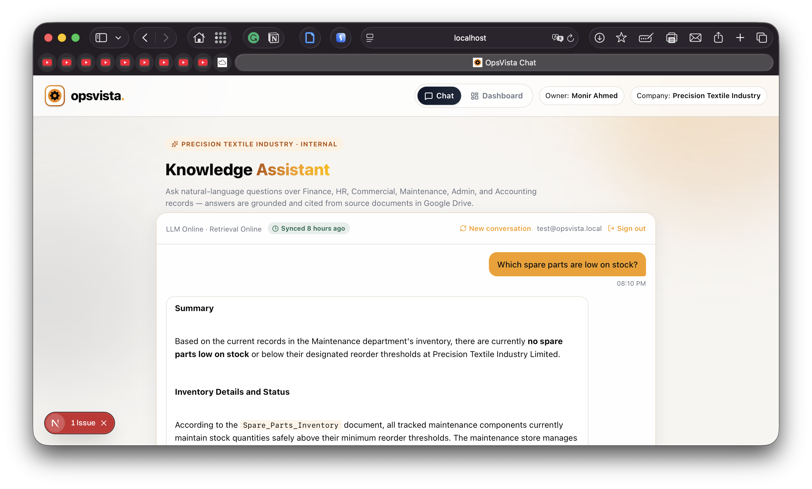
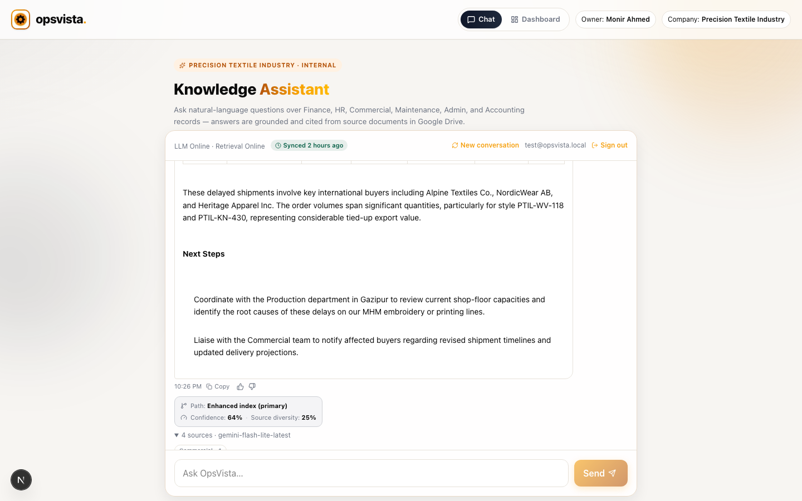
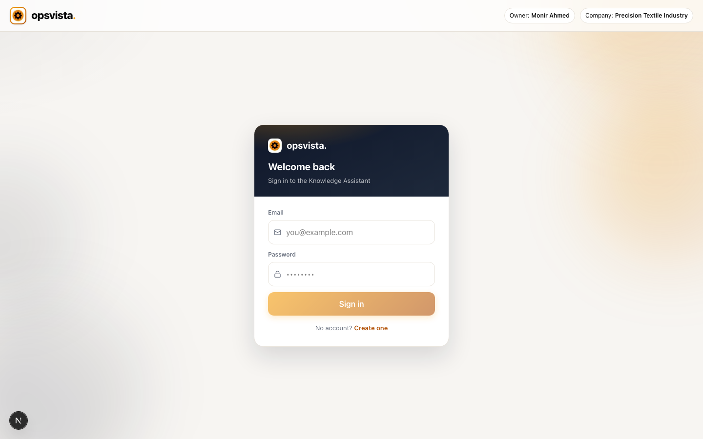
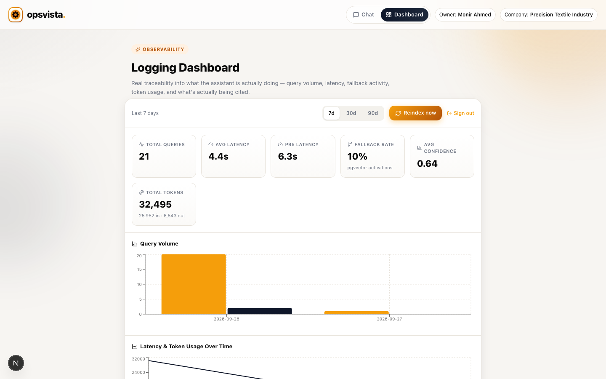
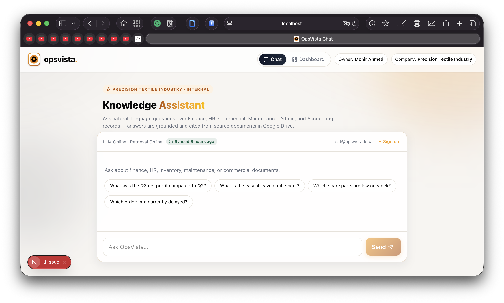

# 🧠 OpsVista — RAG Knowledge Assistant

<div align="center">


**Ask questions about your company's own documents in plain English. Get grounded, cited answers — not guesses.**

Internal knowledge assistant for **Precision Textile Industry LTD (PTIL)**, built end-to-end: dual-path retrieval, real-time streaming, observability dashboard, scheduled reindexing, and role-based access control.

<br/>



<br/>

</div>

---

## 🛠️ Technology Stack

### Languages & Core


### Frontend Framework & Styling


### Backend & AI


-412991?style=for-the-badge&logo=openai&logoColor=white)

### Data, Auth & Vector Store


### Dev Tools, Testing & CI/CD


### Hosting

-46E3B7?style=for-the-badge&logo=render&logoColor=white)
-000000?style=for-the-badge&logo=vercel&logoColor=white)

> **Honesty check:** the backend is genuinely deployed and live on Render (verified: `GET /api/status` → `200`). The frontend has **not** been deployed to Vercel yet — it only runs locally so far (`npm run dev`). Vercel is the intended target (see [Deployment](#-deployment)), not a claim that it's already live.

<br/>

| Category | What's actually used |
|---|---|
| **Backend runtime** | Python 3.13, FastAPI, Uvicorn, Pydantic v2, `slowapi` (rate limiting) |
| **Frontend** | Next.js 15 (App Router), React 19, TypeScript, Tailwind CSS v4, `lucide-react`, `recharts`, `react-markdown` |
| **Database, Auth & Vector Store** | Supabase — managed Postgres, Auth (JWT), Row Level Security, `pgvector` extension |
| **LLM & Embeddings** | Google Gemini (`gemini-flash-lite-latest` generation, `gemini-embedding-001` embeddings) — primary; OpenAI supported as an alternate provider, not actively used |
| **Document ingestion** | Google Drive API v3, `pypdf`, `python-docx`, `pandas` + `openpyxl` |
| **Backend testing** | `pytest`, `pytest-asyncio`, `pytest-mock` — 27 tests (see [Testing](#-testing)) |
| **Frontend testing** | `mocha` + `tsx` — 18 tests (see [Testing](#-testing)) |
| **CI/CD** | GitHub Actions — lint/test/build on every push, nightly scheduled reindex |
| **Hosting** | Render — **live**; Vercel — **planned, not yet deployed** |

---

## 📋 Table of Contents

- [🎯 Overview](#-overview)
- [✨ Features](#-features)
- [🛠️ Technology Stack](#️-technology-stack)
- [🏗️ Architecture](#️-architecture)
- [🚀 Getting Started](#-getting-started)
- [📁 Project Structure](#-project-structure)
- [📡 API Reference](#-api-reference)
- [🔄 Scheduled Reindexing](#-scheduled-reindexing)
- [📊 Observability](#-observability)
- [🔐 Security](#-security)
- [🧪 Testing](#-testing)
- [🌐 Deployment](#-deployment)
- [🖼️ Screenshots](#️-screenshots)
- [🩺 Troubleshooting](#-troubleshooting)
- [📄 License](#-license)

---

## 🎯 Overview

**OpsVista** replaces "dig through Google Drive folders yourself" with a chat assistant that actually knows the company's documents — finance records, HR policy, commercial orders, maintenance logs, admin procedures — and answers in plain English with **citations back to the real source file** so every answer is verifiable, not just plausible-sounding.

### What makes it real (not a demo)

- 🔀 **Genuine dual-path retrieval** — an in-memory vector index (primary) with a Postgres/pgvector fallback that activates on a real confidence + diversity quality gate, not just "zero results"
- ⚡ **Token-by-token streaming** — Server-Sent Events, not a spinner-then-dump
- 🔍 **Grounding transparency** — every answer shows *which* retrieval path answered, its confidence score, and source diversity — not hidden in a log somewhere
- 👍 **Feedback loop** — thumbs up/down on every answer, persisted to the audit trail
- 🌙 **"Everyday" freshness** — a nightly GitHub Actions cron re-scans Google Drive automatically; an Owner/Admin can also trigger it on demand from the dashboard
- 📈 **Real observability** — every query logged (latency, confidence, tokens, fallback rate), rendered as an actual dashboard, not just server logs
- 🔒 **Real RBAC** — Supabase Auth + role-gated admin endpoints, not a checkbox

---

## ✨ Features

### 💬 Chat Experience

- Natural-language Q&A grounded in your own documents, streamed live
- 📎 **Per-answer citations** — file name, department badge, Google Drive link, relevance score
- 📊 **Auto-charted Excel citations** — spreadsheet-derived sources render as a real data table *and* a bar chart, with a magnitude filter so a tiny unit price doesn't get crushed next to a six-figure total
- 🧭 **Retrieval trace panel** — which index answered (primary vs. pgvector fallback), confidence %, source diversity %
- 👍👎 **Feedback buttons** on every answer
- 🕐 **"Synced X ago" badge** — know at a glance how fresh the underlying knowledge base is
- 🗂️ **Department clusters** — see at a glance which departments' documents fed an answer

<br/>

<br/>

### 🔐 Auth & Access

- Email/password signup with name + email confirmation flow
- Session-gated chat access for any employee
- **Owner/Admin-only** observability dashboard and reindex controls
- Real sign-out everywhere — chat page *and* dashboard (no dead-end sessions)

<br/>

<br/>

### 📊 Observability Dashboard

- Query volume, avg/p95 latency, fallback rate, avg confidence, token usage — all real, all from Supabase
- Top cited documents & departments, ranked
- Recent query log with latency/confidence/fallback/tokens per row
- 🔁 **"Reindex now"** button — triggers a real Google Drive re-scan with live progress polling

<br/>

<br/>

### 🔄 Keeping the Knowledge Base Fresh

- Admin-triggered reindex API (`POST /api/rag/admin/reindex`) — full Drive re-scan + re-embed + dual-write, with automatic timestamped backups
- **Nightly scheduled reindex** via GitHub Actions — runs automatically, no human required
- Ephemeral-disk safety — if the local index file goes missing on a redeploy (Render free tier wipes disk), it auto-rehydrates from Supabase on startup

---

---

## 🏗️ Architecture

### How it works (plain English)

1. Company documents (Excel, Word, PDF, Markdown) live in Google Drive, organized by department.
2. A background process reads them, chunks them, and converts each chunk into a vector embedding.
3. A question gets embedded the same way and matched against the most semantically similar chunks.
4. Those chunks go to Gemini, which writes an answer **using only that retrieved context** — the original chunks come back as citations.
5. If the primary search comes back empty or low-confidence, an independent Postgres/pgvector search gets a second try — the **dual-path** design.

```
┌──────────────────────────────────────────────────────────────────────┐
│                          CLIENT (Next.js)                            │
│   Chat UI (streaming)      Login/Signup       Observability Dash     │
└──────────────────────────────┬───────────────────────────────────────┘
                                │  Supabase JWT
┌───────────────────────────────▼───────────────────────────────────────┐
│                        API LAYER (FastAPI)                            │
│  /chat/complete   /chat/stream   /chat/feedback   /admin/reindex       │
│  ┌─────────────────────────────────────────────────────────────┐     │
│  │      retrieve_with_trace() — dual-path quality gate         │     │
│  │  ┌───────────────────────┐      ┌─────────────────────┐     │     │
│  │  │  Enhanced Index (JSON) │ ───▶│ pgvector fallback     │     │     │
│  │  │  primary, in-memory     │◀───│ (confidence < 0.5)    │     │     │
│  │  └───────────────────────┘      └─────────────────────┘     │     │
│  └─────────────────────────────────────────────────────────────┘     │
│                                │                                       │
│                     ┌──────────▼──────────┐                          │
│                     │  Gemini / OpenAI LLM │                          │
│                     └──────────────────────┘                          │
└───────────────────────────────┬─────────────────────────────────────┬─┘
                                │                                     │
                 ┌──────────────▼──────────────┐         ┌────────────▼────────────┐
                 │   Supabase (Postgres)         │         │   Google Drive API v3   │
                 │   dim_document / fact_chunk   │         │   department folders    │
                 │   fact_embedding / fact_query │         └─────────────────────────┘
                 │   bridge_query_citation       │
                 └───────────────────────────────┘
```

<p align="center">
  
</p>

### Dual-path retrieval trace

Every response carries a real `trace` object:

```json
{
  "impl": "enhanced_index",
  "retrieval_confidence": 0.83,
  "source_diversity": 0.75,
  "used_fallback": false
}
```

<p align="center">
  
</p>

> **Diagram note:** shows the original binary "has hits?" design. The real implementation (`retrieve_with_trace()` in `chat.py`) is a superset — it adds confidence-threshold and source-diversity scoring on top of this same fallback structure.

### Full request sequence

<p align="center">
  
</p>

> **Diagram note:** the fallback box (`IntegratedSearchManager`) is from an earlier design — the real fallback is `pgvector_store.py`, and Gemini is primary (OpenAI is the alternate, not the reverse).

### Data model

<p align="center">
  
</p>

> Predates two tables that now exist for real (`fact_query`, `bridge_query_citation`). **[`backend/sql/schema.sql`](backend/sql/schema.sql) is the authoritative, executable schema.**

| Table | Purpose |
|---|---|
| `dim_document` | One row per source file, department, classification |
| `fact_chunk` | Text chunks, ordinal position, full metadata (JSONB) |
| `fact_embedding` | The actual `vector(1536)` embeddings |
| `fact_query` | Audit log: every question, confidence, latency, tokens, fallback flag, user rating |
| `bridge_query_citation` | Which chunks were cited for which query, ranked |

**Why 1536 dims, not Gemini's native 3072?** `pgvector`'s `ivfflat`/`hnsw` indexes cap at 2000 dimensions. Gemini supports requesting a smaller output directly via `output_dimensionality=1536`.

**Why no ANN index on `fact_embedding` right now?** `ivfflat` needs ~`rows/1000` clusters to behave well. At a few hundred rows that's ~0–1 clusters — it made retrieval *worse* in testing. Exact search is both more accurate and fast enough below ~1,000–10,000 rows.

---

## 🚀 Getting Started

### Prerequisites

- Python ≥ 3.11
- Node.js ≥ 18
- A Supabase project (free tier works) with the `vector` extension enabled
- A Gemini API key ([aistudio.google.com/apikey](https://aistudio.google.com/apikey), free tier available) — or an OpenAI key as an alternative
- *(Optional, for real Drive ingestion)* a Google Cloud service account with Drive API access

### 1. Clone and install

```bash
git clone https://github.com/mahirvisoredbroom855/opsvista-software.git
cd opsvista-software

python3 -m venv .venv && source .venv/bin/activate
pip install -r requirements.txt

cd frontend && npm install && cd ..
```

### 2. Configure environment

Copy `.env.example` → `.env` at the repo root and fill in:

```bash
SUPABASE_URL=https://<project>.supabase.co
SUPABASE_ANON_KEY=...
SUPABASE_SERVICE_ROLE_KEY=...        # bypasses RLS — used by ingestion & audit logging

GEMINI_API_KEY=...
GEMINI_MODEL=gemini-flash-lite-latest
GEMINI_EMBEDDING_MODEL=gemini-embedding-001
GEMINI_EMBEDDING_DIM=1536             # must stay ≤2000 for pgvector indexing

USE_MOCK_EMBEDDINGS=false             # true = deterministic hash vectors, zero cost/API calls
GOOGLE_DRIVE_CREDENTIALS_PATH=backend/credentials/google_credentials.json
CORS_ALLOWED_ORIGINS=http://localhost:3000

REINDEX_AUTOMATION_TOKEN=...          # optional — enables the nightly cron trigger (see below)
```

Then run `backend/sql/schema.sql` once in your Supabase project's SQL Editor.

Copy/create `frontend/.env.local`:

```bash
NEXT_PUBLIC_API_BASE_URL=http://localhost:8000
NEXT_PUBLIC_SUPABASE_URL=https://<project>.supabase.co
NEXT_PUBLIC_SUPABASE_ANON_KEY=...
NEXT_PUBLIC_REQUIRE_AUTH=true
```

### 3. Build the index

No Google Drive access yet? Use the local seed documents:

```bash
cd backend
python build_local_index.py --reset
```

Have a real Drive service account set up? See [Google Drive Setup](#google-drive-setup) below, then:

```bash
python build_drive_index.py --reset
```

Either script dual-writes into Supabase automatically.

### 4. Run it

```bash
# Terminal 1 — backend
cd backend && uvicorn app.main:app --reload --port 8000

# Terminal 2 — frontend
cd frontend && npm run dev
```

Visit `http://localhost:3000`, sign up (or sign in), and start asking questions.

### Google Drive Setup

1. **Google Cloud Console** → new project → enable the **Google Drive API**.
2. **APIs & Services → Credentials** → Create Credentials → **Service Account** → create a key (JSON) → save as `backend/credentials/google_credentials.json` (already gitignored).
3. Create one parent Drive folder containing your department subfolders, and **share only that parent folder** with the service account's email — permissions cascade automatically.
4. Upload documents. Supported: Google Docs, `.pdf`, `.docx`, `.xlsx`, `.txt`, `.md`.
5. Run `python build_drive_index.py --reset` (or trigger `POST /api/rag/admin/reindex` from an Owner/Admin session).

---

## 📁 Project Structure

```
opsvista-software/
├── backend/
│   ├── app/
│   │   ├── main.py                          # FastAPI entrypoint, startup hydration, rate limiter wiring
│   │   ├── core/
│   │   │   ├── config.py                    # Pydantic Settings (dev-safe defaults)
│   │   │   ├── auth_deps.py                 # get_current_user / require_roles / automation-token RBAC
│   │   │   ├── supabase_jwt.py              # Token verification via Supabase Auth API
│   │   │   └── rate_limit.py                # Shared slowapi Limiter instance
│   │   └── features/rag_chatbot/
│   │       ├── api/
│   │       │   ├── chat.py                  # /api/rag/chat/* — retrieval, streaming, feedback
│   │       │   ├── admin_metrics.py         # /api/rag/admin/metrics
│   │       │   └── discovery.py             # /api/rag/admin/reindex(/status)
│   │       ├── llm/
│   │       │   ├── llm_client.py            # Provider-agnostic (Gemini/OpenAI) LLM wrapper, streaming
│   │       │   └── prompt_engineering.py    # System prompt + adaptive length policy
│   │       ├── vector/
│   │       │   ├── persisted_inmemory_search.py  # Primary JSON index + shared embed_texts()
│   │       │   ├── pgvector_store.py             # Fallback search, dual-write, audit log, feedback, hydration
│   │       │   └── google_drive_service.py       # Drive API client (service account)
│   │       └── ingestion_common.py          # Shared chunking/extraction (PDF/DOCX/XLSX/TXT/MD)
│   ├── build_local_index.py                 # Build index from a local folder (no Drive/API key needed)
│   ├── build_drive_index.py                 # Build index from real Google Drive
│   ├── sql/schema.sql                        # Full Supabase schema, RLS, match_chunks() RPC
│   ├── tests/                                # 27 pytest tests, mock embeddings, no network calls
│   └── seed_docs/                            # Realistic dummy PTIL documents (Excel/Word/PDF/MD)
│
├── frontend/
│   ├── src/
│   │   ├── app/
│   │   │   ├── page.tsx                      # Chat UI — streaming, citations, charts, trace, feedback
│   │   │   ├── login/page.tsx                # Sign in / sign up (name + email confirmation)
│   │   │   ├── dashboard/page.tsx            # Observability dashboard + reindex control (Owner/Admin)
│   │   │   └── globals.css                   # Tailwind v4 + hand-written component styles
│   │   ├── components/SiteNav.tsx            # Header nav
│   │   └── lib/
│   │       ├── chatUtils.ts                  # Pure helpers (unit-tested)
│   │       └── supabaseClient.ts
│   └── test/chatUtils.test.ts                 # Mocha unit tests
│
├── .github/workflows/
│   ├── ci.yml                                 # Lint + pytest + Mocha + build, on every push
│   └── scheduled-reindex.yml                  # Nightly cron: triggers + polls the reindex endpoint
│
├── screenshots/                               # Real UI screenshots (this README)
├── pictures/                                  # Architecture diagrams
└── render.yaml                                # Render Blueprint for one-click backend deploy
```

---

## 📡 API Reference

Interactive OpenAPI docs are always available at `/docs` on a running backend.

| Method | Endpoint | Purpose | Auth |
|---|---|---|---|
| `GET` | `/api/status` | Overall app health, no external calls | Public |
| `GET` | `/api/rag/chat/status` | LLM + retrieval provider status | Public |
| `GET` | `/api/rag/chat/index/status` | Index metadata (size, last-modified) | Public |
| `POST` | `/api/rag/chat/complete` | Ask a question, get a cited answer (single JSON response) | Signed-in user |
| `POST` | `/api/rag/chat/stream` | Same pipeline, streamed as Server-Sent Events | Signed-in user |
| `POST` | `/api/rag/chat/feedback` | Thumbs up/down on a completed answer | Signed-in user |
| `GET` | `/api/rag/chat/_retrieve` | Debug: raw retrieval results, no LLM call | Signed-in user |
| `GET` | `/api/rag/admin/metrics` | Observability dashboard data | **Owner/Admin** |
| `POST` | `/api/rag/admin/reindex` | Trigger a full Drive re-scan + re-embed | **Owner/Admin**, or automation token |
| `GET` | `/api/rag/admin/reindex/status` | Poll reindex progress | **Owner/Admin**, or automation token |

### Streaming response events (`/api/rag/chat/stream`)

| Event | Payload | When |
|---|---|---|
| `meta` | `chat_id`, `sources`, `trace`, `warnings`, `created` | Immediately after retrieval, before generation |
| `token` | `content` (a text fragment) | Once per chunk the LLM streams back |
| `warning` | `message` | If context had to be truncated mid-generation |
| `error` | `message` | If generation fails after retrieval succeeded |
| `done` | `chat_id`, `model`, `usage`, `processing_time_ms` | Stream complete |

### Response shape (`/complete`)

```json
{
  "chat_id": "e0225265-...",
  "content": "### Summary\nAccording to the Leave and Attendance Policy...",
  "model": "gemini-flash-lite-latest",
  "sources": [
    {
      "text": "Casual Leave: 10 days, requires 1 day advance notice...",
      "score": 0.78,
      "metadata": {
        "file_name": "Leave_and_Attendance_Policy.md",
        "department": "HR",
        "source": "google_drive",
        "drive_file_id": "1abc...",
        "table": null
      }
    }
  ],
  "usage": { "prompt_tokens": 696, "completion_tokens": 126, "total_tokens": 822 },
  "trace": { "impl": "enhanced_index", "retrieval_confidence": 0.78, "used_fallback": false },
  "warnings": []
}
```

`warnings[]` is populated when: no documents were found, the fallback path was used, the fallback was attempted but also came up empty, or context was truncated to fit `MAX_CONTEXT_TOKENS` (default `6000`).

<p align="center">
  
</p>

---

## 🔄 Scheduled Reindexing

Editing or adding a file in Google Drive doesn't propagate automatically by itself — ingestion is a full rescan, triggered either manually or on a schedule:

| Trigger | How |
|---|---|
| **Nightly (automatic)** | GitHub Actions cron (`.github/workflows/scheduled-reindex.yml`), 03:00 UTC daily |
| **On demand (admin)** | "Reindex now" button in the dashboard, or `POST /api/rag/admin/reindex` |
| **On demand (CLI)** | `python build_drive_index.py --reset` |

The cron job authenticates with a static `X-Automation-Token` header instead of a Supabase session — set `REINDEX_AUTOMATION_TOKEN` the same on your backend and as `REINDEX_AUTOMATION_TOKEN`/`BACKEND_URL` GitHub Actions secrets. Disabled entirely unless that env var is set.

A timestamped backup of the previous index is kept automatically (`backend/app/features/rag_chatbot/vector/backups/`, last 5 retained) before every reset.

---

## 📊 Observability

Every chat request writes a row to `fact_query` (confidence, latency, tokens, fallback flag, user rating) and `bridge_query_citation` (which chunks were cited, ranked) — real, queryable data.

Three ways to look at it:
1. **The dashboard** — `/dashboard` (Owner/Admin): query volume, latency, fallback rate, token usage, top cited documents/departments, recent query log, reindex control
2. **Supabase Studio** — Table Editor on `fact_query` / `bridge_query_citation`
3. **Backend logs** — `tail -f` your uvicorn output; Render's built-in log viewer shows the same on deploy

<p align="center">
  
</p>

---

## 🔐 Security

- **Auth**: Supabase Auth (email/password), JWTs verified server-side against Supabase's own Auth API
- **RBAC**: `require_roles(["Owner", "Admin"])` gates the admin dashboard and reindex trigger:
  ```python
  supabase.auth.admin.update_user_by_id(user_id, {"app_metadata": {"role": "Owner"}})
  ```
- **Row Level Security**: enabled on all 5 tables — corpus tables readable by any authenticated user, writable only via the service-role key
- **Rate limiting**: per-IP via `slowapi` — 20/min chat, 60/min metrics, 3/min reindex, 120/min global default
- **Secrets**: service-role keys, JWT secrets, Drive credentials, and the reindex automation token are never committed — see `.gitignore`

---

## 🧪 Testing

| Suite | Framework | Tests | What it needs |
|---|---|---|---|
| Backend | `pytest` + `pytest-asyncio` + `pytest-mock` | 27 | Nothing external — mock embeddings, no network calls, no API cost |
| Backend (boot check) | plain `python -c "import app.main"` | 1 | Catches missing deps `pytest` alone wouldn't (see below) |
| Frontend | `mocha` + `tsx` | 18 | Nothing external — pure functions only, no DOM/browser needed |
| Frontend (lint) | `biome check` | — | Nothing external |
| Frontend (build) | `next build` | — | Type-checks the whole app |

Run everything locally exactly as CI does:

```bash
# Backend
cd backend && pip install -r requirements-test.txt && pytest -v

# Frontend
cd frontend && npm run lint && npm run test && npm run build
```

### Backend — pytest (27 tests)

```bash
cd backend
pip install -r requirements-test.txt
pytest -v
```

Mock embeddings throughout (no network calls, no API cost). Covers:
- `ingestion_common.py` — chunking, PDF/DOCX/XLSX extraction against real generated fixtures
- `persisted_inmemory_search.py` — ingest/search/persist round trips
- `chat.py` — quality-gate logic (`_retrieval_confidence`, `_source_diversity`, `_enforce_token_budget`), dual-path branching
- `pgvector_store.py` — config-detection logic

A smoke-import test also runs in CI (`python -c "import app.main"`) — pytest alone never exercises `app.main`, so a missing dependency used only at boot can pass tests and still crash the real server. This exact scenario happened once already (`slowapi` was undeclared) and is why the check exists.

### Frontend — Mocha (18 tests)

```bash
cd frontend
npm run test
```

Covers the pure functions in `src/lib/chatUtils.ts`: numeric-column detection, chartable-column selection (the magnitude-filter logic behind auto-charted Excel citations), relative-time formatting.

### Frontend — lint & build

```bash
cd frontend
npm run lint     # biome check
npm run build    # next build (also type-checks)
```

### CI

Both suites run automatically on every push via [`.github/workflows/ci.yml`](.github/workflows/ci.yml) — lint, pytest, Mocha, and a production build, so nothing merges silently broken.

---

## 🌐 Deployment

<p align="center">
  
</p>

> Diagram shows "OpenAI API" — Gemini is primary now (OpenAI is the alternate). Everything else matches: Vercel → Render/Uvicorn → FastAPI → Chat Router → Supabase / LLM provider / Google Drive / local index file.

### Backend → Render

A [`render.yaml`](render.yaml) Blueprint is included — **New → Blueprint** in the Render dashboard, point it at this repo.

- **Build command**: `pip install -r requirements.txt`
- **Start command**: `cd backend && uvicorn app.main:app --host 0.0.0.0 --port $PORT`
- **Health check**: `/api/status`
- Fill in the `sync: false` secrets in the dashboard (Render never reads secret values from the repo)
- For the admin-triggered reindex to work in production, upload `google_credentials.json` via Render's **Secret Files** feature — without it, chat still works (index hydrates from Supabase on boot), only a *fresh Drive scan* needs it

### Frontend → Vercel

- Root directory: `frontend/`
- Framework preset: Next.js (auto-detected)
- Set the `NEXT_PUBLIC_*` variables, pointing `NEXT_PUBLIC_API_BASE_URL` at your Render backend URL

### Nightly reindex

Add `BACKEND_URL` and `REINDEX_AUTOMATION_TOKEN` as GitHub Actions repository secrets (Settings → Secrets and variables → Actions), and the same `REINDEX_AUTOMATION_TOKEN` value in Render's environment. See [Scheduled Reindexing](#-scheduled-reindexing).

### Post-deploy checklist

- [ ] `CORS_ALLOWED_ORIGINS` includes your real Vercel domain
- [ ] Supabase Auth → URL Configuration → Site URL points at your Vercel domain
- [ ] `GET /api/status` returns `200`
- [ ] Sign up, confirm email, sign in, ask a question, confirm citations render
- [ ] GitHub Actions secrets set, manually trigger `Scheduled Reindex` once to confirm end-to-end

---

## 🖼️ Screenshots

### Chat — real answer, citations, trace panel


### Chat — expanded sources & feedback


### Observability Dashboard


### Login


### Empty chat state



---

## 🩺 Troubleshooting

**"Enhanced index not found" / empty results**
Run `python backend/build_local_index.py --reset` (or `build_drive_index.py`). Check startup logs — should say it rehydrated from Supabase automatically; if not, verify `SUPABASE_SERVICE_ROLE_KEY`.

**"Invalid or expired Supabase token" on every request**
Confirm `SUPABASE_URL`/`SUPABASE_ANON_KEY` match between frontend and backend, and the frontend is sending `Authorization: Bearer <token>` (check Network tab).

**403 on `/api/rag/admin/*`**
RBAC working as intended — the user isn't `Owner`/`Admin` in `app_metadata.role`.

**401 on the scheduled reindex GitHub Action**
`REINDEX_AUTOMATION_TOKEN` mismatch between GitHub Actions secrets and the backend's env var — must be byte-identical.

**429 Too Many Requests**
Rate limiting working as intended — wait a minute, or adjust the relevant `@limiter.limit(...)`.

**Gemini embedding dimension mismatch after changing `GEMINI_EMBEDDING_DIM`**
`fact_embedding.embedding` is a fixed-width `vector(1536)`. Changing the dimension requires dropping/recreating that column and rebuilding the index.

---

## 📄 License

**Proprietary Software** — © 2026 Precision Textile Industry LTD. All rights reserved. Access restricted to authorized PTIL personnel and approved contractors under confidentiality agreements.

<div align="center">

**Built for Precision Textile Industry LTD**

</div>
